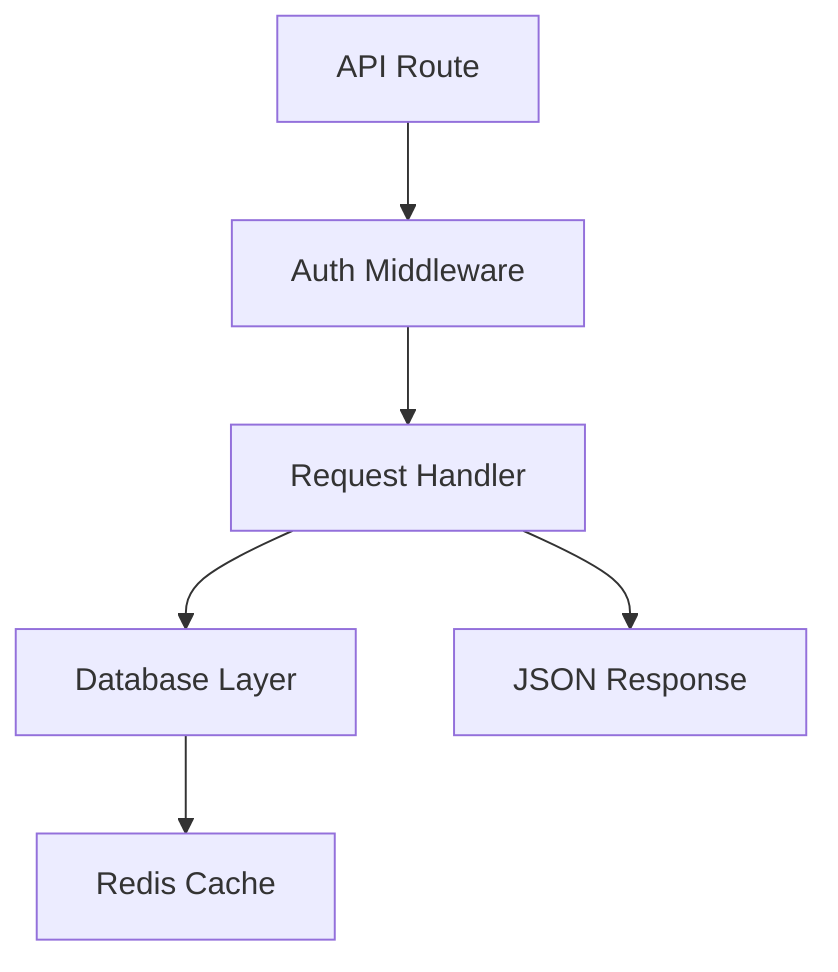

# The Blueprint Pattern

A structured 8-step coding protocol that catches 80% of bugs before they ship and maintains quality across context-limited AI sessions.

## Why This Exists

AI coding agents have two failure modes:
1. **Context drift** — after 10+ files, quality degrades rapidly
2. **Phantom success** — "it works" declared before actual testing

The Blueprint Pattern addresses both by separating AI work from deterministic verification, and capping the feedback loop at 2 rounds.

---

## Step-by-Step with Examples

### Step 1 — PRE-FETCH

**What:** Gather all files, docs, and context BEFORE writing any code.

**Why:** Fetching mid-implementation poisons context. Pre-load everything.

**How:**
```
Read: src/auth/session.ts, src/api/users.ts, tests/auth.test.ts
Read: package.json (dependency versions)
Read: README (any relevant setup notes)
Read: CHANGELOG (breaking changes in recent versions)
```

**Example pre-fetch checklist:**
- [ ] All files mentioned in the spec
- [ ] All files that import/use those files
- [ ] Relevant docs for external libraries
- [ ] Existing tests for the affected code
- [ ] Configuration files (tsconfig, webpack, etc.)

---

### Step 2 — LLM LOOP (Generate)

**What:** Write the code.

**Rules:**
- One complete implementation per loop (not drafts)
- Write tests alongside the code, not after
- If you hit an unknown, document it as a `// TODO: clarify` — don't guess
- Keep functions small and testable

**Example:**
```typescript
// auth/session.ts
export class SessionManager {
  constructor(private readonly store: SessionStore) {}
  
  async create(userId: string, ttlSeconds: number = 86400): Promise<Session> {
    const token = crypto.randomUUID();
    const expiresAt = new Date(Date.now() + ttlSeconds * 1000);
    await this.store.set(token, { userId, expiresAt });
    return { token, userId, expiresAt };
  }
  
  async validate(token: string): Promise<Session | null> {
    const session = await this.store.get(token);
    if (!session || session.expiresAt < new Date()) return null;
    return session;
  }
}
```

---

### Step 3 — DETERMINISTIC (Test Pass 1)

**What:** Run ALL checks. Record exact output.

**No AI in this step.** Just run commands and capture output.

```bash
# TypeScript
tsc --noEmit 2>&1 | tee /tmp/tsc-output.txt
echo "TSC exit: $?"

# Lint
eslint src/ --ext .ts 2>&1 | tee /tmp/lint-output.txt
echo "Lint exit: $?"

# Tests
npm test 2>&1 | tee /tmp/test-output.txt
echo "Test exit: $?"
```

**Record everything.** Don't summarize — exact output matters.

---

### Step 4 — LLM LOOP (Fix)

**What:** Read the test output and fix failures.

**Rules:**
- One failure at a time, in order
- Understand WHY before fixing
- Don't mask errors with suppression comments

**Example failure analysis:**
```
Error: Type 'string | undefined' is not assignable to type 'string'.
  → session.userId is possibly undefined in validate()
  → Fix: add null check before accessing userId
```

---

### Step 5 — DETERMINISTIC (Test Pass 2)

Same as Step 3. All checks again. Clean run required.

---

### Step 6 — CAP

**What:** If tests still fail after Step 5, stop.

**Why:** A 3rd round is almost always worse, not better. Context degradation is real.

**Do instead:**
1. Document exact failing tests and error messages
2. Describe your diagnosis: "The issue is X, likely caused by Y"
3. List what you tried and why it didn't work
4. Return to orchestrator for direction

**Template:**
```
CAP REACHED — unable to resolve after 2 rounds.

Failing: tests/auth.test.ts line 44 — "invalid session token"
Diagnosis: The session store mock isn't resetting between tests. The issue is in the test setup, not the implementation.
Tried: clearing mock in afterEach, using fresh instances — both failed.
Recommendation: Review test isolation strategy. The implementation appears correct.
```

---

### Step 7 — SUBMIT

**What:** Create a PR or deliver the result with full context.

**PR description template:**
```markdown
## What Changed
[Clear description of the change]

## Why
[Link to spec/issue, or brief explanation]

## How It Works
[Architecture explanation if non-obvious]

## Testing
[What was tested and how]

## Notes / Deviations from Spec
[Any places where you deviated from the spec, and why]
```

---

### Step 8 — SMOKE TEST

**What:** One real data sample, end-to-end.

**Why:** Unit tests can pass while the system is broken.

**Example:**
```bash
# Real input
curl -X POST http://localhost:3000/auth/login \
  -H "Content-Type: application/json" \
  -d '{"username": "test@example.com", "password": "test123"}'

# Expected output
{"token": "...", "expiresAt": "..."}

# Verify session works
curl http://localhost:3000/api/me \
  -H "Authorization: Bearer [token from above]"
```

**Smoke test is not optional.** If you can't run it, say why in your report.

---

## Common Anti-Patterns

| Anti-Pattern | What to Do Instead |
|-------------|-------------------|
| "It looks right" | Run the tests |
| Skipping smoke test | Find a way to test end-to-end or flag explicitly |
| 3rd CI round | CAP and escalate |
| Suppressing type errors | Fix the type error |
| Fetching context mid-loop | Stop, gather context, restart |
| "Tests are passing" before running them | Run the commands, paste the output |

---

## Mermaid Diagram Requirement

For any task touching 3+ files, draw this before starting:



If you can't draw the diagram cleanly, you don't understand the task yet. Clarify before proceeding.
